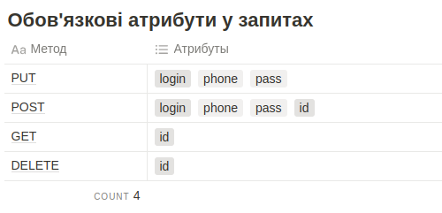

To start the project run 'docker compose up -d --build'  
If something goes wrong, run 'docker compose down' and then 'docker system prune -a' that will delete all containers to start from 'fresh start'. 
If you were running kubernetes before you need to delete all images in kubernetes context too because there are sometimes conflicts between images and containers.  
Very rarely but if you on Ubuntu sometimes you eve need to restart it and then run 'docker system prune -a'   
Put '127.0.0.1       test_task_3.com' into /etc/hosts.  
To get into fpm container 'docker exec -it test_task_3-fpm-1 bash'  
run composer install in container  
Most of the endpoints will be provided with Postman collection  
 
 
Deviations from original task:   
 
Original task: "Сутність користувача складається з 4 атрибутів \$id, \$login, \$phone, \$pass" 
Completed task: \$id, \$login, \$phone, \$password" (it was necessary to have field \$password to implement PasswordAuthenticatedUserInterface by User entity)
 
 
Original task: "Використання будь-яких компонентів symfony, але FOS* компонентом symfony вже не рахуємо."
Completed task: used only php-cs-fixer from FOS as it is not main functionality but code must be standardized.
 
 
Original task:

Completed task:  
PUT - login, phone, pass, id (because when you edit, it exists) 
POST - login, phone, pass (because when you post you add new)
 
 
Original task: 
Реалізувати ендпоінт по урлу:
 /v1/api/users 
Ендпоінт повинен приймати в себе 4 типи запитів:
**GET**,  **POST**, **PUT**, **DELETE**.
 
Completed task:
/v1/api/users - gets all users, /v1/api/user/id - (GET, POST, PUT, DELETE) for one user.
 
 
 
Original task: 
Застосунок закрит зовні, спосіб авторизації Bearer. Два типи токена:
"testAdmin" - має право на GET, POST, PUT, DELETE без обмежень;
"testUser" - має право на GET, POST, PUT але тільки в рамках свого користувача, видаляти не може.
 
 
Completed task: 
'ROLE_ADMIN', 'ROLE_USER' 
Plus one endpoint for getting bearer by credentials API login: /v1/api/login wiht body: {"username": "user2", "password": "1234"} 
 
 

Also not clear why do you need dump of DB if fixtures exists? But anyway I did it.
 
 
There is some REALLY BAD coding in app/src/Controller/Api/V1/UserController.php:isViolationUserUniqueValid.  
It was made due to unclear business logic.  
Also it was made in order to be able to use Symfony standard validator with cusotom constraints #[AcmeAssert\ConstraintUserUnique()].  
It is not clear if user can change his own logic or not. 
If user cannot change his login then this logic not needed.  
There are of course better solutions but I wasn't able to spend more time on test task.